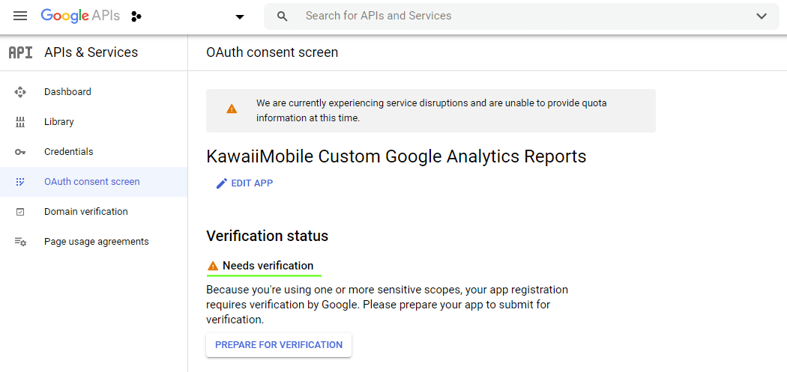
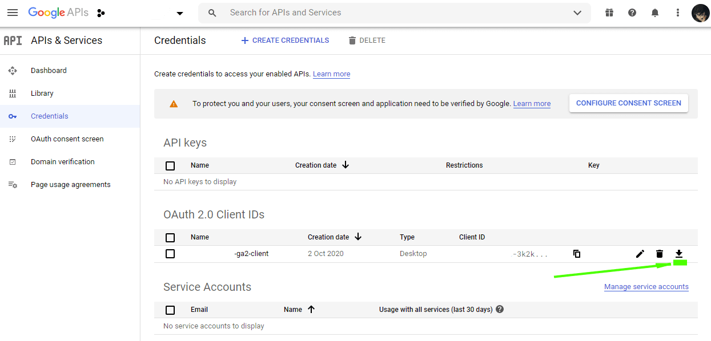
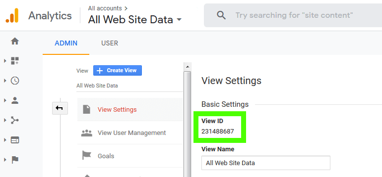

You should start exploring the Google Analytics Reporting API with the official documentation:

https://developers.google.com/analytics/devguides/reporting/core/v4
https://developers.google.com/api-client-library/dotnet/get_started

If you need to access Google Analytics reports from C #, you can do this using a library from Google.
Create a .NET Core console project and connect the "Google.Apis.AnalyticsReporting.v4" nuget package to it.

To be able to access Google Analytics reporting data, you will need to create an application in the console https://console.developers.google.com/
If this is a project for personal use, you don't have to worry about filling out all the fields: the browser will give you a warning, but you can go ahead and allow access.



**"Prepare for verification"** is worth completing if you are making a project for public use (not your personal).

Go to the section **"Credentials"**, and download the secret file **client_secret_XXXX.apps.googleusercontent.com.json**:


Even if this is a test project, I recommend not explicitly including such a file in it (so as not to accidentally commit it to github), but place it in a separate folder on the machine. The example below uses a special environment variable that stores the path to the secret file.

Go to the Google Analytics admin panel and copy the View ID - it will be needed for programmatically building the report:



## Example project on GitHub

In my repository [https://github.com/AndrewSalko/kawaii.ga.analyser](https://github.com/AndrewSalko/kawaii.ga.analyser) you will find an example project. 
Below I will describe certain points.

## Using OAuth to access API

I put the **client_secret_XXXX.apps.googleusercontent.com.json** file in the "secret folder" on the machine, and the full path to it in the environment variable. Below I read it and use the **AuthorizeAsync** method:

```csharp
string jsonAPIFile = Environment.GetEnvironmentVariable(ENV_VAR_JSON_SECRET_FILE);
if (string.IsNullOrEmpty(jsonAPIFile))
{
	Console.WriteLine("Environment variable not found:" + ENV_VAR_JSON_SECRET_FILE);
}

UriBuilder uri = new UriBuilder(Assembly.GetExecutingAssembly().CodeBase);
string startPath = Path.GetDirectoryName(Uri.UnescapeDataString(uri.Path));

string jsonAPIAuth = Path.Combine(startPath, jsonAPIFile);

UserCredential credential;

using (var stream = new FileStream(jsonAPIAuth, FileMode.Open, FileAccess.Read))
{
	string credPath = Path.Combine(startPath, "creds.json");

	credential = GoogleWebAuthorizationBroker.AuthorizeAsync(
						GoogleClientSecrets.Load(stream).Secrets,
						_SCOPES,
						"user",
						CancellationToken.None,
						new FileDataStore(credPath, true)).Result;
}

var init = new BaseClientService.Initializer
{
	ApplicationName = "kawaiimobile-ga2",
	HttpClientInitializer = credential
};

var service = new Google.Apis.AnalyticsReporting.v4.AnalyticsReportingService(init);
```

We use the **AnalyticsReportingService service** object to build reports.

See the [VisitedPagesReportBuilder.cs](https://github.com/AndrewSalko/kawaii.ga.analyser/blob/master/kawaii.ga.analyser/PagesReport/VisitedPagesReportBuilder.cs) for details.

To build a report on page visits, we need a date range and a set of metrics:

```csharp

// Create the DateRange object.
DateRange dateRange = new DateRange()
{
	StartDate = ReportDate.GetDateAsString(startDate),
	EndDate = ReportDate.GetDateAsString(endDate)
};

// Create the Metrics object.

Metric pageViewsMetric = new Metric { Expression = "ga:pageviews", Alias = "Page views" };
Metric uniquePageViewsMetric = new Metric { Expression = "ga:uniquePageviews", Alias = "Unique page views" };
Metric entrancesMetric = new Metric { Expression = "ga:entrances", Alias = "Entrances" };

//Create the Dimensions object.
Dimension dimensionPage = new Dimension { Name = "ga:pagePath" };

OrderBy order = new OrderBy
{
	FieldName = "ga:pageviews",
	SortOrder = "DESCENDING"
};
```
Use https://ga-dev-tools.appspot.com/dimensions-metrics-explorer/ to explore possible metrics.

## Report request

```csharp
ReportRequest reportRequest = new ReportRequest
{
	ViewId = _GAViewID,
	DateRanges = new List<DateRange>() { dateRange },
	Dimensions = new List<Dimension>() { dimensionPage },
	Metrics = new List<Metric>() { pageViewsMetric, uniquePageViewsMetric, entrancesMetric },
	OrderBys = new List<OrderBy> { order },
	PageToken = nextPageToken
};

List<ReportRequest> requests = new List<ReportRequest>();
requests.Add(reportRequest);

// Create the GetReportsRequest object.
GetReportsRequest getReport = new GetReportsRequest() { ReportRequests = requests };

// Call the batchGet method.
GetReportsResponse response = _Service.Reports.BatchGet(getReport).Execute();
```
Data acquisition cycle. You will need to parse and type the results:

```csharp
var report = response.Reports[0];
var rows = report.Data.Rows;

foreach (var row in rows)
{
	string url = row.Dimensions[0];

	string valPageViews = row.Metrics[0].Values[0];
	string valUniqPageViews = row.Metrics[0].Values[1];
	string valEntrances = row.Metrics[0].Values[2];

	int pageViews = int.Parse(valPageViews);
	int uniqPageViews = int.Parse(valUniqPageViews);
	int entrances = int.Parse(valEntrances);

	var reportRow = new VisitedPagesReportRow(url, pageViews, uniqPageViews, entrances);
	reportRows.Add(reportRow);

}//foreach
```
In general, building Google Analytics reports programmatically is a fairly simple task, but it contains a number of important points for understanding - registering an application through the [Google Console](https://console.developers.google.com), as well as studying possible metrics through [Dimensions & Metrics Explorer](https://ga-dev-tools.appspot.com/dimensions-metrics-explorer).


