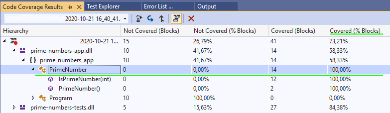

Robust applications usually include automated testing (unit tests, integration tests).
Below we will look at an example of a simple application and unit tests for it, and also figure out how to check code coverage in the case applying different editions of Visual Studio.

The application contains a PrimeNumber.cs class that lets you determine if an integer is "prime".

The prime-numbers-app project itself is designed as a console application. It is recommended to place unit tests in a separate project.
To do this, create it via a console call:

```bat
dotnet new mstest -n prime-numbers-tests
```


The unit test project file has the following packages connected:

```xml
<Project Sdk="Microsoft.NET.Sdk">
  <PropertyGroup>
    <TargetFramework>netcoreapp3.1</TargetFramework>
    <RootNamespace>prime_numbers_tests</RootNamespace>

    <IsPackable>false</IsPackable>
  </PropertyGroup>

  <ItemGroup>
    <PackageReference Include="Microsoft.NET.Test.Sdk" Version="16.5.0" />
    <PackageReference Include="MSTest.TestAdapter" Version="2.1.0" />
    <PackageReference Include="MSTest.TestFramework" Version="2.1.0" />
    <PackageReference Include="coverlet.collector" Version="1.2.0" />
  </ItemGroup>
</Project>
```
If you want to write programs suitable for unit testing, follow these simple rules:

1) Each class must perform only one action
2) Avoid passing your other classes to the constructor, but pass interfaces
Thus, you will often have a situation when, together with a class, you immediately declare its interface.

3) If you need to create an instance of another class in one class, you shouldn't just write MyClass x = new MyClass().
In this case, you cannot replace its implementation with a stub. Instead, you should createa class factory, and it should "spawn" what you want.

In the sample project, we will test one class - **PrimeNumber**. For this, the **PrimeNumberTests** test class has been created.

Each test class must be marked with the **[TestClass]** attribute, and the test methods must be **[TestMethod]**.
But for even greater clarity, I recommend using the **[Description]** attributes to describe the test as well, and **[TestCategory]**, in the category we will pass the name of the class that is being tested. This way you can group tests and see them in a convenient form in Visual Studio.

```csharp
[TestClass]
public class PrimeNumberTests
{
	/// <summary>
	/// For 0-argument throws ArgumentException
	/// </summary>
	[TestMethod]
	[Description("Unit test for zero argument")]
	[TestCategory("IsPrimeNumber")]
	public void IsPrimeNumber_ZeroArg_Exception()
	{
		try
		{
			var prime = new PrimeNumber();

            //Zero is forbidden argument, so Exception must be thrown
            prime.IsPrimeNumber(0);

            Assert.Fail("ArgumentException expected");
		}
		catch (ArgumentException ex)
		{
			//Caller must know argument's name - so validate it here
			Assert.IsTrue(ex.ParamName == "number");
		}
	}

}
```

## Code coverage

Unit tests give you confidence that the changes you make do not break what used to work. Of course, one should check all sorts of variations of how your classes (and programs in general) work, but it's impossible to track everything manually.
Code coverage allows you to see exactly which parts of the classes were checked during the test run, and which remained untested.

If you are using Visual Studio Community, you have basic testing capabilities at your disposal, without code coverage analysis.

With Test Explorer, you can run tests and see the results:


**Visual Studio Enterprise** contains a built-in code coverage analysis tool:



## Free code coverage analysis tool

Unit tests can be performed via a console call. You can create a .bat file with the following content:

```bat
cd prime-numbers-tests
dotnet test --collect:"XPlat Code Coverage" -r "..\TestResults"
```
In the console, you will see the result of running tests:


The **collect:"XPlat Code Coverage"** argument is important in order to apply the results visualization tool.

Download the [ReportGenerator](https://github.com/danielpalme/ReportGenerator) utility from GitHub, with its help you can get the html pages of the code coverage report.

An example of a report building command:

```bat
reportgenerator  "-reports:TestResults\17d7824a-3a89-4a90-af48-da769b1d416e\coverage.cobertura.xml" "-targetdir:TestsCoverageReport" -reporttypes:Html
```
It is worth noting that the generation of the coverage.cobertura.xml file always goes to the folder with the guid name, so adjust the example to suit your case.
In the **TestsCoverageReport** folder you will see index.html, open it with a browser - this is an interactive report:


As you can see, our **PrimeNumber** class has 100% test coverage. You can click on it in the report to see each line tested.

In my repository [https://github.com/AndrewSalko/prime-numbers-unittest-example](https://github.com/AndrewSalko/prime-numbers-unittest-example) you will find an example project, .bat files for console run tests and build a report.


